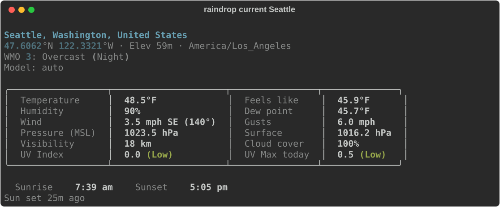
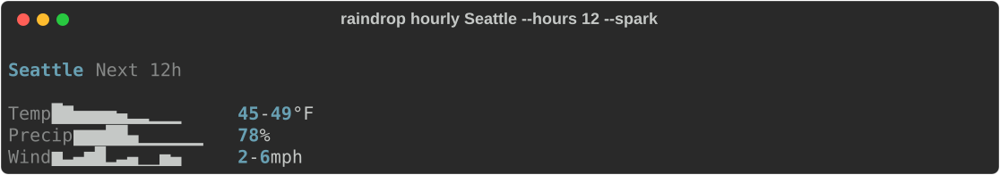
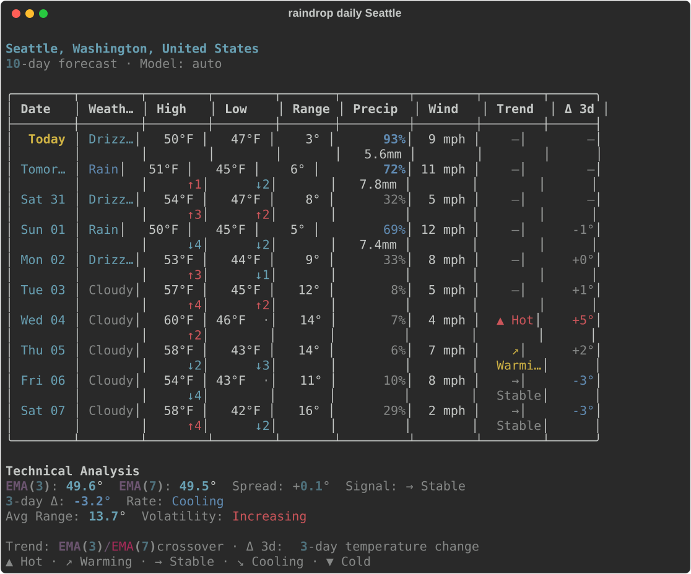
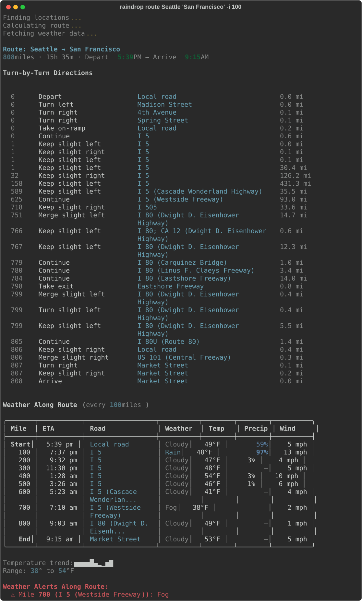
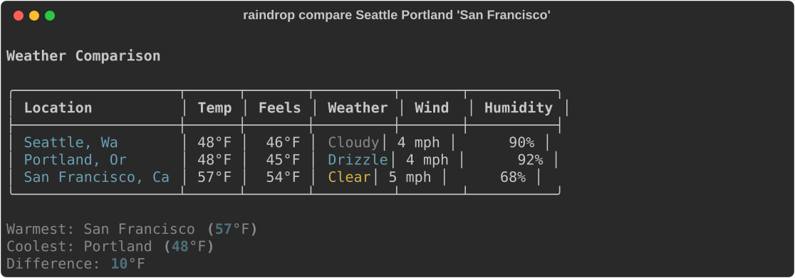
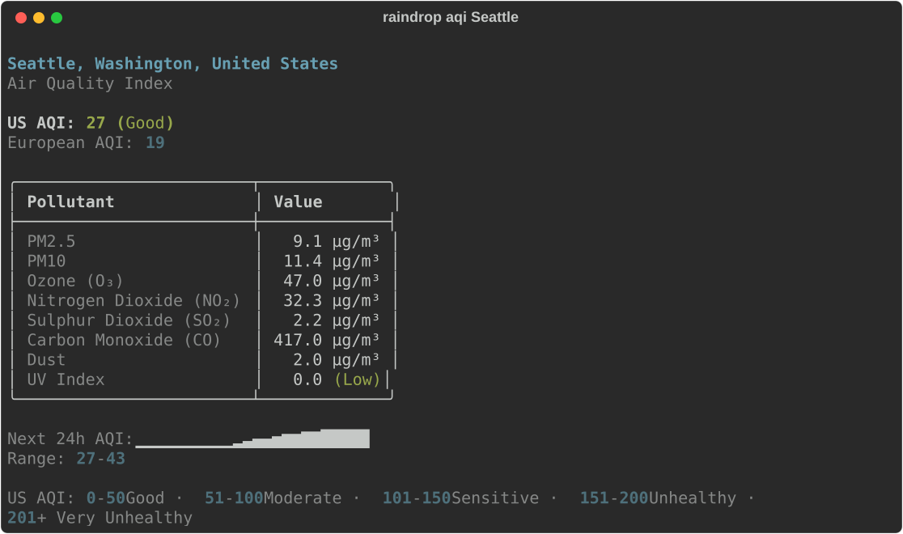
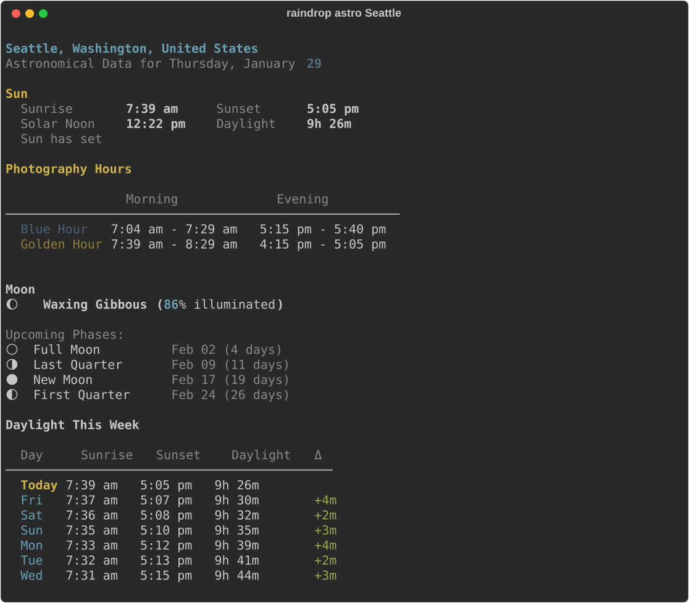
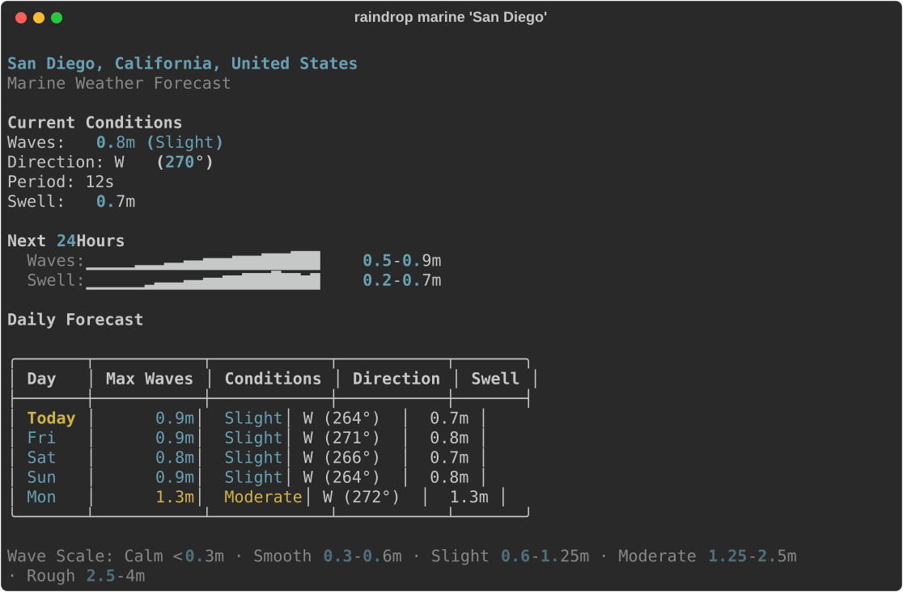
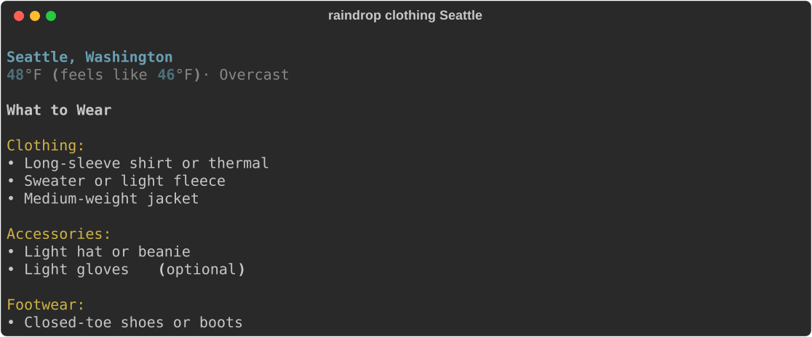

<p align="center">
  
</p>

<h1 align="center">Raindrop</h1>

<p align="center">
  <strong>A beautiful, feature-rich weather CLI for your terminal.</strong><br>
  Sparklines, route planning, live dashboards, marine forecasts, measured stations, and more — core forecasts need no API key.
</p>

<p align="center">
  <a href="#installation"></a>
  <a href="#commands"></a>
  <a href="https://open-meteo.com/"></a>
  <a href="#license"></a>
  <a href="#"></a>
</p>

<br>

<p align="center">
  
</p>

---

## Why Raindrop?

Most weather CLIs give you temperature and a condition. Raindrop gives you **everything**:

- **Sparkline graphs** — `▁▂▃▅▇█▅▃` temperature and precipitation trends at a glance
- **Technical analysis** — EMA crossovers, rate-of-change, and volatility on forecasts
- **Real driving routes** — weather checkpoints along actual roads via OpenStreetMap
- **Full-screen dashboard** — live TUI with auto-refresh
- **Astronomical data** — moon phases, golden hour, blue hour, daylight tracking
- **Marine forecasts** — wave height, swell, water temp for coastal trips
- **Zero-key core weather** — forecasts, dashboards, routes, air quality, alerts, and astronomy use free/open APIs
- **Optional measured stations** — nearby personal/official observations via Xweather when you configure a key

---

## Installation

**Requirements:** Python 3.12+

```bash
# pip
pip install rdrop

# From source
git clone https://github.com/binarydoubling/raindrop.git
cd raindrop
pip install -e .
```

---

## Quick Start

```bash
raindrop current Seattle                          # current conditions
raindrop window Seattle                           # sensory weather scene
raindrop stations nearby Fairbanks                 # nearby PWS observations (optional Xweather key)
raindrop hourly "New York" --spark --hours 12     # sparkline forecast
raindrop daily Portland                           # 10-day with trend analysis
raindrop dashboard Seattle --refresh 300          # live full-screen TUI
raindrop route "Seattle" "San Francisco" -i 100   # road trip weather
raindrop aqi Beijing                              # air quality index
raindrop favorites add home "Seattle, WA"         # save a location
raindrop current home                             # use it anywhere
```

---

## Features

### Weather Window

Translate weather variables into the feel of standing outside: air texture, sky, light, motion, surfaces, and distance.

```bash
raindrop window Seattle
raindrop outside Tokyo --compact
```

### Current Weather


### Measured Station Observations

Nearby personal weather station and official station observations through Xweather. These are measured station readings with station IDs, source classification, timestamps, QC/trust status, and freshness — separate from `raindrop current`, which remains Open-Meteo model/gridded current conditions.

```bash
raindrop stations nearby Fairbanks
raindrop stations nearby Fairbanks --kind pws
raindrop stations current PWS_SM9110
```

Xweather is optional and requires credentials. Human output includes the required attribution: Powered by Vaisala Xweather.

### Hourly Forecast with Sparklines



### 10-Day Forecast with Technical Analysis

EMA crossovers, rate-of-change indicators, and trend detection applied to weather data.



### Route Weather Planning

Plan road trips with weather at every checkpoint along the actual driving route.



### Compare Multiple Locations



### Air Quality Index



### Astronomical Data

Moon phases, golden hour, blue hour, and weekly daylight tracking.



### Marine Forecasts



### Clothing Recommendations



### Live Dashboard

Full-screen TUI powered by Rich with automatic refresh.

```bash
raindrop dashboard Seattle --refresh 300
```

---

## Commands

| Command | Description | Example |
|---------|-------------|---------|
| `window` / `outside` | First-person weather scene | `raindrop window Seattle` |
| `current` | Current conditions | `raindrop current Seattle` |
| `stations` | Measured station observations | `raindrop stations nearby Fairbanks` |
| `hourly` | Hourly forecast (48h) | `raindrop hourly Seattle --spark` |
| `daily` | 10-day forecast with trends | `raindrop daily Seattle` |
| `dashboard` | Full-screen live TUI | `raindrop dashboard Seattle` |
| `route` | Weather along a driving route | `raindrop route "A" "B" -i 50` |
| `compare` | Compare multiple locations | `raindrop compare NYC LA Chicago` |
| `alerts` | NWS weather alerts (US) | `raindrop alerts Seattle` |
| `aqi` | Air quality index | `raindrop aqi Seattle` |
| `astro` | Moon phase, golden hour | `raindrop astro Seattle` |
| `marine` | Ocean/wave forecasts | `raindrop marine "San Diego"` |
| `clothing` | What to wear | `raindrop clothing Seattle` |
| `history` | Compare with past years | `raindrop history Seattle` |
| `discussion` | NWS forecast discussion | `raindrop discussion Seattle` |
| `precip` | Precipitation totals | `raindrop precip Seattle --days 7` |
| `fav` / `favorites` | Manage saved locations | `raindrop favorites list` |
| `config` | View/edit settings | `raindrop config show` |
| `completions` | Shell completions | `raindrop completions bash` |

### Global Options

```
--no-cache                 Bypass the API response cache for fresh data
--version                  Show the installed version
--help                     Show help for any command
```

Most data commands also support `--json` for scripting and `-c/--country` for ISO country filtering.
Use `raindrop config set units metric|imperial` to switch unit presets.

---

## Configuration

Settings live at `$RAINDROP_CONFIG_DIR/config.json`, `$XDG_CONFIG_HOME/raindrop/config.json`, or `~/.config/raindrop/config.json`.
API responses are cached under `$RAINDROP_CACHE_DIR`, `$XDG_CACHE_HOME/raindrop`, or `~/.cache/raindrop`.

Optional Xweather credentials for `raindrop stations` can be supplied with `XWEATHER_API_KEY` or a mode-0600 JSON file at the same config directory, e.g. `~/.config/raindrop/xweather.json`:

```json
{"api_key":"<your combined Xweather API key>"}
```

Existing forecast/current commands remain keyless. `raindrop config show` only reports Xweather as configured/not configured and never prints the key.

```bash
raindrop config show                  # view current settings
raindrop config set units metric      # switch to metric
raindrop config set location "NYC"    # set default location
raindrop config cache                 # view cache stats
raindrop config cache --clear         # clear cache
```

| Setting | Values | Default | Description |
|---------|--------|---------|-------------|
| `units` | `imperial`, `metric` | `imperial` | Shortcut that updates the unit fields below |
| `temperature_unit` | `fahrenheit`, `celsius` | `fahrenheit` | Temperature display unit |
| `wind_speed_unit` | `mph`, `kmh`, `ms`, `kn` | `mph` | Wind speed display unit |
| `precipitation_unit` | `mm`, `inch` | `mm` | Precipitation display unit |
| `location` | any string | none | Default location |
| `country_code` | ISO 3166-1 alpha-2 | none | Default country filter |
| `model` | `auto` or `raindrop config models` value | `auto` | Open-Meteo forecast model |

---

## Shell Completions

```bash
# Bash
raindrop completions bash >> ~/.bashrc && source ~/.bashrc

# Zsh
raindrop completions zsh >> ~/.zshrc && source ~/.zshrc

# Fish
raindrop completions fish > ~/.config/fish/completions/raindrop.fish
```

---

## How It Works

Raindrop combines several free/open APIs for core weather, with optional credentialed providers for measured observations:

| API | Purpose |
|-----|---------|
| [Open-Meteo](https://open-meteo.com/) | Forecasts, historical data, air quality, geocoding |
| [OSRM](http://project-osrm.org/) | Real driving routes via OpenStreetMap |
| [NWS](https://www.weather.gov/documentation/services-web-api) | Weather alerts and forecast discussions (US) |
| [Xweather](https://www.xweather.com/) | Optional measured personal/official station observations |

The entire project has only **2 runtime dependencies** (Click and Rich). HTTP, caching, geocoding, credentials, and astronomical calculations are all handled with Python's standard library.

### Technical Highlights

- **Weather window scene engine** that infers air texture, sky, light, motion, surface, and horizon from combined variables
- **Measured station observations** with provider/source identity, timestamps, QC/trust labels, freshness filtering, and safe credential-free cache keys
- **Sparklines** via Unicode block characters (`▁▂▃▄▅▆▇█`)
- **EMA crossovers** and rate-of-change analysis on temperature data
- **Pure-Python astronomy** — moon phases, Julian day, daylight duration with no external libs
- **Haversine sampling** along OSRM polylines for route weather checkpoints
- **File-based cache** with SHA256 keys and endpoint-specific TTLs
- **14 weather models** selectable: ECMWF, GFS, HRRR, ICON, ARPEGE, AROME, UKMO, GEM, JMA, MetNo, and more

---

## Regenerating Screenshots

The feature screenshots in this README are real CLI output captured as SVGs:

```bash
python scripts/capture.py            # capture all commands
python scripts/capture.py current    # capture a specific command
```

---

## Contributing

```bash
git clone https://github.com/binarydoubling/raindrop.git
cd raindrop
uv sync
uv run pytest
uv run ruff check
uv run pyright
```

---

## License

[MIT](LICENSE)

---

<p align="center">
  <sub>Built with coffee and curiosity in the Pacific Northwest — where checking the weather is a lifestyle.</sub>
</p>
